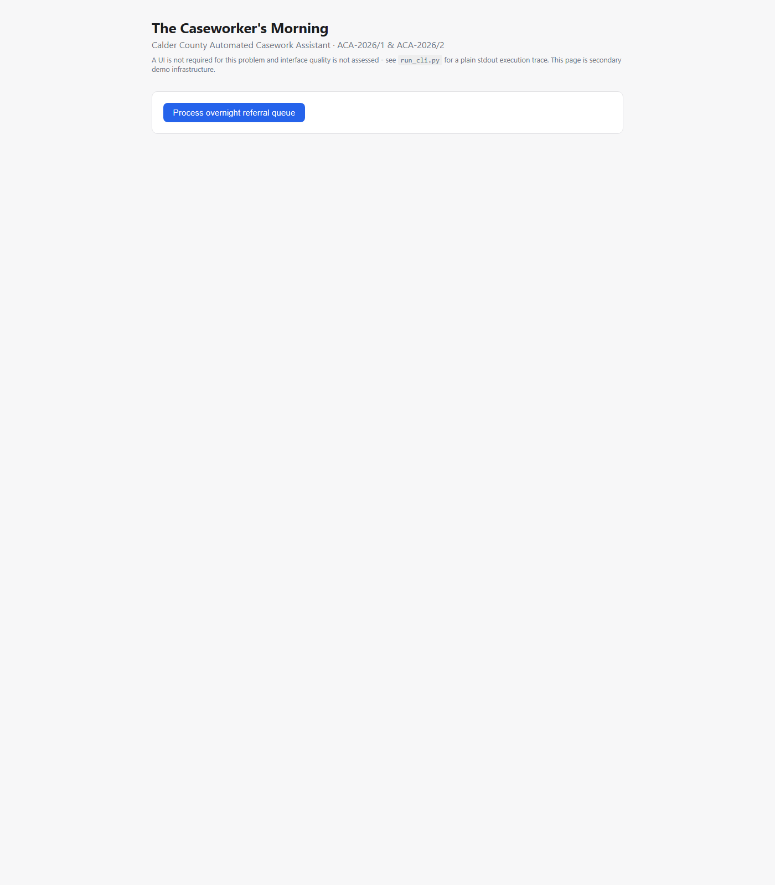

# 🧑‍💼 The Caseworker's Morning

> An agentic workflow that automates repetitive caseworker morning processing while
> enforcing human approval and authority-aware guardrails.


Built for **Brite Spark 2026, Problem 5 (Agentic AI / Guardrails)**, against the
official supplied data pack — the fixed 12-referral queue, the Resident History API,
authority policy **ACA-2026/1**, and the Day-2 surprise amendment **ACA-2026/2**.

---

## 🚀 Live Demo

**App (UI + API):** https://caseworker-morning-agent.onrender.com/
**API docs (Swagger):** https://caseworker-morning-agent.onrender.com/docs
**Resident History Service:** https://caseworker-history-service.onrender.com

> The live deployment uses the official supplied referral and resident history data
> pack — the same fixed 12-referral queue and resident records as local development,
> not a mock or a subset.

This is a free-tier demo deployment (Render's free plan), **not a production
deployment** — cold starts after idle periods are expected, and the audit log
(SQLite) is not persisted across redeploys. See [Known limitations](#known-limitations)
and `DECISIONS.md` → "Deployment" for the full, honest account, including a real
production incident (private networking failed, was diagnosed live, and fixed) that's
documented rather than glossed over.

<!--
SCREENSHOT NEEDED — see "Screenshots & demo" below for exactly what to capture.

-->

## 🎥 20-Second Demo

<!--
DEMO GIF NEEDED — see "Screenshots & demo" below for exactly what to capture.

-->

## Screenshots & demo — what still needs to be captured

No screenshot or recording exists in this repository yet, and none has been faked
here. To finish this section, capture and add:

1. **`docs/images/dashboard.png`** — open the [live app](https://caseworker-morning-agent.onrender.com/),
   click **"Process overnight referral queue"**, let the run complete, and screenshot
   the page once the summary counts and the referral results list are visible (the
   state showing 6 autonomous / 3 escalated / 3 hand-off).
2. **`docs/demo.gif`** — a short (~20s) screen recording of the same flow: load the
   page → click the button → the run completes → scroll through a couple of referral
   cards (ideally one autonomous, one escalated, one hand-off) → open the audit log
   section. Convert to a GIF (e.g. with ScreenToGif, Kap, or `ffmpeg`) and keep it
   small enough for GitHub to render inline.

Once both files exist at those paths, uncomment the two image tags above — no other
README changes are needed.

---

## What it is

> A caseworker starts every day the same way: check the referrals that came in
> overnight, pull each resident's history, and draft a triage note on what should
> happen next. None of it is difficult, all of it is necessary, and it happens before
> the caseworker has done anything that needs their actual judgement.

An agent processes the official 12-referral overnight queue end to end. For each
referral it:

1. Reads the referral (ACA-2026/1 §2.1).
2. Retrieves the resident's history, household, and case events from the official
   Resident History API (§2.2).
3. Evaluates the requested action against ACA-2026/1 §3 (does it need supervisor
   approval — a change to entitlement/award, suspension/termination/reinstatement, a
   payment-details change, a communication, a disclosure, a fraud finding, or anything
   ambiguous — §6.1 treats "unclear" as "yes"):
   - **Yes** → no action is taken, nothing is drafted, an **escalation** is created
     with full context (§4). The rest of the queue keeps processing.
   - **No** → continue to step 4.
4. Evaluates the household for ACA-2026/2 §3.9 (does it include a person under 18):
   - **Yes**, or household composition cannot be established → **no triage note is
     drafted at all**, not even a partial or "for review" one. A **hand-off** is
     created instead, preserving everything already retrieved. The rest of the queue
     keeps processing.
   - **No** → draft a triage note (§2.4) — a proposal with no effect until a
     caseworker adopts it.

Every step, decision, and outcome is written to a full execution trace (§5.1),
visible via `run_cli.py`, the API's audit log, or the frontend.

## Why it matters

The official problem statement deliberately includes a referral that asks for
something outside the agent's authority — recognising it, refusing it, escalating it,
and continuing with the rest of the queue is part of the floor, not a bonus. This
project treats that as the central design constraint, not an edge case bolted on
afterward: the escalation path and the ACA-2026/2 hand-off path are first-class
outcomes, tested and traced exactly like the autonomous path.

## What makes it different

- **Structural safety, not a permission check.** There is no function anywhere in
  this codebase that suspends/terminates/reinstates an award, changes payment
  details, sends a communication, discloses resident information, or records a
  finding of fact — these aren't gated behind an approval flag that could be
  bypassed, they were simply never built. See `DECISIONS.md` → "Structural Safety" for
  exactly how that's verified.
- **Escalation and hand-off are deliberately distinct** — different triggers (§3 vs
  §3.9), different meanings, different audit actions — not one generic "blocked"
  bucket.
- **Policy is data, not branches.** ACA-2026/1's restricted-action rules live in
  `backend/app/policy_rules.json`; a new restricted category is a data change, not a
  code change.
- **Partial work is never discarded.** History/household data already retrieved for a
  referral is reused for its hand-off record — never re-fetched, never thrown away.
- **One referral escalating or handing off never stops the queue.** Every one of the
  12 referrals is always reached and recorded, including a `failed` outcome that
  isolates an unexpected per-referral error instead of crashing the run.
- **Honest deployment documentation.** The live demo's `DECISIONS.md` → "Deployment"
  entry documents a real production connectivity failure (Render private networking
  didn't resolve), how it was diagnosed from live audit logs, and how it was fixed —
  not just the happy path.

## How to try it

**Fastest — no setup:** open the [live demo](https://caseworker-morning-agent.onrender.com/)
and click **"Process overnight referral queue"**, or hit the API directly at
[`/docs`](https://caseworker-morning-agent.onrender.com/docs).

**Locally, no API/UI needed** — prints the full execution trace to stdout, which
alone satisfies the problem's traceability requirement:

```bash
python data-pack/services/history_service.py --port 8083   # terminal 1
cd backend && python run_cli.py                              # terminal 2
```

**Locally, with the API + frontend** — see [Installation](#installation) below.

---

## Key features

- End-to-end agent run over the official 12-referral queue
- Policy-driven evaluation (ACA-2026/1 §2–§4, §6.1), rules kept as data
  (`backend/app/policy_rules.json`), not hardcoded per-referral branches
- Structural drafting guard for ACA-2026/2 §3.9 (see "Structural safety" below)
- Clear, tested distinction between **escalation** and **hand-off**
- Escalating or handing off one referral never stops the rest of the queue
- Partial-work preservation: history/household data already retrieved for a referral
  is reused for its hand-off record, never discarded or re-fetched
- Full execution trace, both as plain stdout (`run_cli.py`) and via the API/audit log
- Millisecond-precision audit timestamps, with SQLite's `seq` (not the timestamp) as
  the authoritative ordering guarantee
- Safe run cancellation
- Optional caseworker note-adoption step (approve/reject), reusing a generic,
  independently-tested explicit-decision primitive (never treats silence, timeout, or
  an ambiguous response as approval)

## Architecture

```
data-pack/                     official files, unmodified (referral queue, policy,
                                history service + data, ACA-2026/2 amendment)
backend/app/
  referrals.py                 loads the official queue (read-only)
  history_client.py            HTTP client for the official Resident History API
  policy.py + policy_rules.json  ACA-2026/1 evaluator (autonomous / escalation)
                                and ACA-2026/2 evaluator (household / hand-off)
  triage.py                    drafts a note, or refuses (ACA-2026/2 guard)
  llm.py                       optional, isolated note-phrasing (see "LLM usage")
  orchestrator.py               per-referral pipeline + execution trace + audit log
  guardrails.py                explicit approve/reject decision primitive
  db.py                        SQLite audit log
  main.py                      FastAPI app (JSON API + serves frontend/)
run_cli.py                     stdout execution-trace runner (no API/UI needed)
frontend/                      minimal demo UI (not required for this problem)
deploy/run_history_service.py  deployment-only host/port wrapper around the
                                official history service (see DECISIONS.md)
render.yaml                    Render Blueprint for the live demo (two services)
```

Extension points for a future policy change: a new restricted-action category or
keyword → edit `policy_rules.json` (data, not code); a new workflow step → add it to
`orchestrator.py`'s pipeline; a new tool/action → add a module next to `triage.py`; a
new data source → add a client next to `history_client.py`.

## Technology stack

- Python 3.11, FastAPI, SQLite (stdlib `sqlite3`), httpx
- The official history service: Python 3 standard library only (`data-pack/services/`)
- Plain HTML/CSS/JavaScript frontend (no build step, no framework — and not required
  for this problem; see "Not required" in `data-pack/README.md`'s companion problem
  statement)
- pytest for automated tests (83 passing — see [Test instructions](#test-instructions))
- Render (Blueprint deployment) for the live demo above

---

## Prerequisites

- Python 3.10 or later
- pip

## Installation

```bash
git clone https://github.com/poojaaxx/caseworker-morning-agent.git
cd caseworker-morning-agent
cd backend
python -m venv .venv

# Windows
.venv\Scripts\activate
# macOS / Linux
source .venv/bin/activate

pip install -r requirements.txt
```

## Configuration

No configuration is required. Optionally export `ANTHROPIC_API_KEY` to let triage
notes be phrased by an LLM instead of a deterministic template (see "LLM usage"
below) — everything else runs identically either way. `HISTORY_SERVICE_URL` can
override the resident-history API base URL (default `http://127.0.0.1:8083`); the
test suite sets this itself to a disposable instance and does not need it set
manually.

## Running the history service

The agent calls the official Resident History API over HTTP, so it must be running
first, in its own terminal:

```bash
python data-pack/services/history_service.py --port 8083
```

This is the organizers' unmodified script (`GET /residents/<ref>`,
`/residents/<ref>/household`, `/residents/<ref>/events`, `/health`) — see
`data-pack/README.md`.

## Run instructions

### Plain stdout trace (no other setup)

With the history service running, from `backend/` with the virtualenv activated:

```bash
python run_cli.py
```

Prints every referral's outcome, policy basis, and full trace directly to the
terminal. This alone satisfies the problem's traceability requirement — see "Not
required" in the official problem statement: a UI is not needed.

### API + minimal frontend

```bash
uvicorn app.main:app --reload
```

Then open **http://127.0.0.1:8000**, or use the API directly: `POST /api/runs` starts
a run and processes the whole queue; `GET /api/runs/{id}` returns its state;
`POST /api/runs/{id}/referrals/{referral_id}/adopt` (body `{"decision": "approve"}` or
`"reject"`) adopts or declines a drafted note; `POST /api/runs/{id}/cancel` cancels an
in-progress run; `GET /api/runs/{id}/audit` returns the full audit trail.

## Test instructions

The test suite starts its own disposable copy of the official history service — no
manual setup needed. From `backend/`, with the virtual environment activated:

```bash
pytest
```

(Takes roughly two minutes: many tests run the full 12-referral pipeline against the
real service, which has built-in simulated per-request latency by design — see
`data-pack/services/history_service.py`'s docstring.) Currently **83 tests**, all
passing.

## Example workflow

```bash
python data-pack/services/history_service.py --port 8083   # terminal 1
python run_cli.py                                            # terminal 2
```

`run_cli.py` prints all 12 referrals: which were drafted autonomously, which were
escalated (with the exact policy section and reason), and which were handed off under
ACA-2026/2 (with "TRIAGE NOTE NOT GENERATED" made explicit). Verified result, both
locally and on the live deployment: **6 autonomous, 3 escalated, 3 hand-off, 0
failed, 0 not_processed**.

---

## Human approval / escalation / hand-off

There is no "propose an out-of-authority action, then a human approves it, then the
agent executes it" flow in this system — see **Structural safety** below for why that
is a stronger guarantee, not a missing feature. What ACA-2026/1 §2.4 does describe is
a human decision: a drafted triage note is a proposal with no effect until a
caseworker **adopts** it. That is the one place this system asks for an explicit
human decision (`POST .../adopt`, body `{"decision": "approve"}` or `"reject"}`).
Anything else — missing, empty, wrong case, wrong type, `"yes"` — is rejected by the
same explicit-decision primitive used throughout (`guardrails.py`) and never treated
as approval.

## Structural safety

`DECISIONS.md` → **"Structural Safety"** states, precisely, what this codebase cannot
do without a human and how that is verified — not what it was told not to do.

## Failure behavior

- History service unreachable or a resident not found: recorded, never crashes the
  run; referrals whose action would otherwise be autonomous conservatively hand off
  (ACA-2026/2 §5.2), while escalation-required referrals are unaffected (their
  classification does not depend on history data).
- Malformed date of birth for a household member: treated conservatively as hand-off,
  same as an unreachable service.
- Malformed/missing referral queue file: the run fails fast with a clear error rather
  than silently processing a partial or invented queue.
- Cancelling a run preserves every referral already processed and marks the rest
  `not_processed` — nothing already done is discarded or repeated.
- An already-completed or already-cancelled run cannot be cancelled again (400, not
  silently accepted).
- Adopting/declining a note twice, or for a referral that was escalated/handed off
  (no note exists), is rejected (400).
- An unexpected error processing one referral is recorded against that referral only
  (`failed`) and does not stop the rest of the queue.

## Known limitations

- The 12-referral queue and history data are the official, fixed dataset supplied
  with the problem — this system does not generalize to referral types beyond it (the
  official problem statement explicitly does not require that).
- Run state lives in-memory in the FastAPI process; the audit log (SQLite) and every
  referral's result are what survive a restart, not an in-progress run's position.
- `policy_rules.json`'s keyword rules are our own structured translation of the prose
  policy (see `DECISIONS.md` → "Policy as Data") — a genuinely novel restricted-action
  category would need a new rule added to that file, not full NLU.
- "Sending" a communication, changing payment details, etc. are not implemented at
  all (see Structural safety) — this system escalates them, it does not simulate
  performing them.
- The live Render deployment is a free-tier demo: cold starts after idle periods, and
  SQLite is not persisted across redeploys/restarts. See `DECISIONS.md` → "Deployment".

## Future improvements

See `DECISIONS.md` → "What We Would Improve First."

## Clean clone verification

Verified by running exactly the steps above (`git clone` → venv → `pip install` →
start the history service → `pytest` → `python run_cli.py`) from a fresh clone in an
empty directory. See `DECISIONS.md` for the specific run log.

**This repository remains the official, reproducible submission** — everything above
works from a clean clone with no deployment platform involved. The live demo is
additional, optional infrastructure, not a replacement for it.

## Live deployment details

`render.yaml` at the repo root is a Render Blueprint defining two services:

- **`caseworker-history-service`** — the official, unmodified
  `data-pack/services/history_service.py`, started via `deploy/run_history_service.py`
  (a thin wrapper that only changes host/port binding for a hosted environment — see
  that file's docstring, and `DECISIONS.md` → "Deployment" for exactly why and how
  this is still honestly "the unmodified official service"). Reachable at its own
  public URL — private networking (`fromService`/`hostport`) was tried first and did
  not resolve on Render's free plan; `DECISIONS.md` → "Deployment" has the full,
  honest account of that, including how it was diagnosed from two real production
  runs' audit logs.
- **`caseworker-morning-agent`** — the same FastAPI app + frontend described above,
  unchanged, with `HISTORY_SERVICE_URL` pointed at the history service's public URL
  instead of defaulting to `localhost`.

To deploy your own copy: connect this GitHub repository in the Render dashboard as a
Blueprint (New → Blueprint), point it at `render.yaml`, and deploy both services — no
manual per-service configuration is needed beyond that.

## Further reading

- [`DECISIONS.md`](DECISIONS.md) — the full design log: what was built, what was
  corrected, what was rejected, and why, including the deployment incident above
- [`AI-USAGE.md`](AI-USAGE.md) — how AI assistance was used on this project
- [`data-pack/README.md`](data-pack/README.md) — the official problem statement and
  data pack this project was built against
