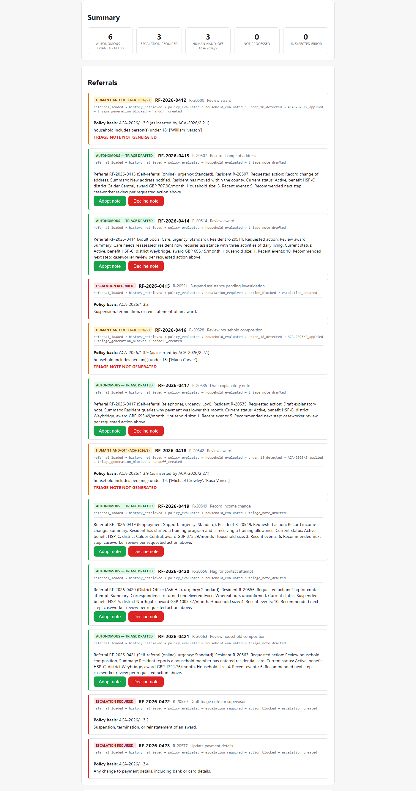
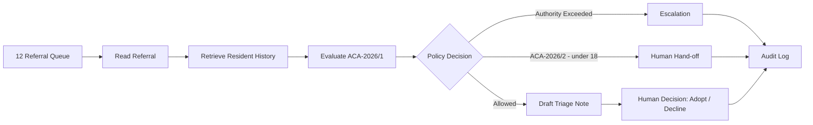
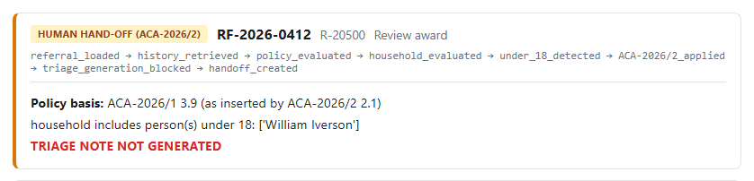
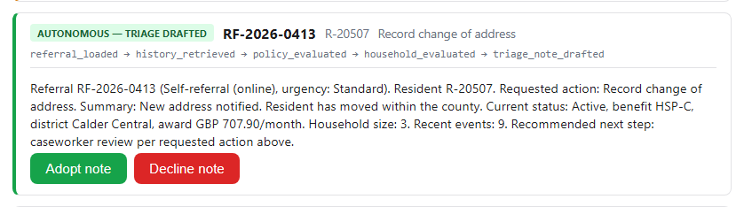
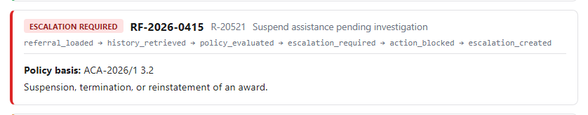

<div align="center">

# 🧑‍💼 The Caseworker's Morning

### An agent that processes overnight referrals end-to-end — and knows exactly when to stop and ask a human.

[](https://www.python.org/)
[](https://fastapi.tiangolo.com/)
[](https://github.com/poojaaxx/caseworker-morning-agent)
[](https://caseworker-morning-agent.onrender.com/)

**Built for Brite Spark 2026, Problem 5 (Agentic AI / Guardrails) — an agent that reads a referral, pulls the resident's history, and drafts a triage note, but structurally cannot perform or draft anything outside its written authority.**

[🚀 Live Demo](https://caseworker-morning-agent.onrender.com/) · [📖 Documentation](DECISIONS.md) · [💻 Repository](https://github.com/poojaaxx/caseworker-morning-agent)

</div>

---

## 📊 See It In Action

<div align="center">

</div>

> A real run against the [live deployment](https://caseworker-morning-agent.onrender.com/) — all 12 official referrals, captured straight from the actual app (see [Screenshots](#-screenshots) for how).

**`docs/demo/overview.gif` has not been recorded yet.** No fake GIF has been added in
its place — see [GIF status](#-gif-status) for exactly what's missing and why, and the
real screenshot above for genuine, current visual proof in the meantime.

---

## ❓ Problem

> A caseworker starts every day the same way: check the referrals that came in
> overnight, pull each resident's history, and draft a triage note on what should
> happen next. None of it is difficult, all of it is necessary, and it happens before
> the caseworker has done anything that needs their actual judgement.
>
> At least one referral in the queue asks for something outside the agent's authority.
> Recognising it, refusing it, escalating it, and carrying on with the rest is part of
> the floor, not a bonus.

This is the official Brite Spark 2026 Problem 5 brief, built against the organizers'
own data pack (`data-pack/`) — the fixed 12-referral queue, the Resident History API,
authority policy **ACA-2026/1**, and the Day-2 surprise amendment **ACA-2026/2**.

## ✅ Solution

An agent processes the official 12-referral overnight queue end to end. For each
referral it:

1. **Reads** the referral (§2.1).
2. **Retrieves** the resident's history, household, and case events from the official
   Resident History API (§2.2).
3. **Evaluates the requested action** against ACA-2026/1 §3 — does it need supervisor
   approval (a change to entitlement/award, suspension/termination/reinstatement, a
   payment-details change, a communication, a disclosure, a fraud finding, or anything
   ambiguous — §6.1 treats "unclear" as "yes")?
   - **Yes** → nothing is performed, nothing is drafted, an **escalation** is created
     with full context (§4). The rest of the queue keeps processing.
   - **No** → continue.
4. **Evaluates the household** for ACA-2026/2 §3.9 — does it include a person under 18?
   - **Yes**, or composition can't be established → **no triage note is drafted at
     all**, not even a draft. A **hand-off** is created instead, preserving everything
     already retrieved.
   - **No** → draft a triage note (§2.4) — a proposal with no effect until a
     caseworker adopts it.

Every step is written to a full execution trace (§5.1) — visible via `run_cli.py`,
the API's audit log, or the frontend.

## 💡 Why This Approach

| Design choice | Why |
|---|---|
| Escalation and hand-off are **separate outcomes**, not one "blocked" bucket | ACA-2026/2 §3.3 explicitly requires the distinction — different triggers, different meanings, different audit actions |
| Restricted actions have **no implementation at all**, not a permission check | A capability that doesn't exist can't be bypassed by a bug or a prompt; see [Structural Safety](#-structural-safety) |
| Policy lives in **data** (`policy_rules.json`), not `if` branches | The official brief's own guidance: a policy change shouldn't require a code change |
| History is fetched **once per referral** and reused everywhere | Nothing already retrieved is thrown away when a hand-off is created |
| One referral escalating/handing off **never stops the queue** | All 12 referrals are always reached and recorded, every time |

## 🌟 Key Features

- End-to-end agent run over the official 12-referral queue
- Policy-driven evaluation (ACA-2026/1 §2–§4, §6.1), rules kept as data, not hardcoded branches
- Structural drafting guard for ACA-2026/2 §3.9
- Tested, first-class distinction between **escalation** and **hand-off**
- Full execution trace — plain stdout (`run_cli.py`) and via the API/audit log
- Millisecond-precision audit timestamps (SQLite `seq` is the authoritative order)
- Safe run cancellation, with everything already processed preserved
- Optional caseworker note-adoption step (approve/reject) that never treats silence,
  timeout, or an ambiguous response as approval

---

## 🔄 Core Workflow



Every box above is a real step in `orchestrator.py`'s pipeline, not an illustration —
the same node names appear in the execution trace (`run_cli.py`, the API's audit log,
and the screenshots in this README).

**`docs/demo/core-workflow.gif` has not been recorded yet** — see [GIF status](#-gif-status).

---

## 🔀 Handling the Day-2 Change

Partway through, the organizers issued **ACA-2026/2**: an amendment inserting §3.9 —
drafting a triage note is itself prohibited (not just its adoption) for a household
that includes a person under 18, with a hand-off that must be visibly distinct from
an escalation and must preserve any work already done.

<div align="center">

</div>

> RF-2026-0412 — the household includes a minor (William Iverson). No triage note is
> generated at all; the run states `TRIAGE NOTE NOT GENERATED` explicitly.

**Every requirement mapped onto an existing extension point — no module was rewritten:**

| Requirement | Landed in |
|---|---|
| New restricted-drafting rule | `evaluate_household_for_aca_2026_2` in `policy.py` — the module already built to hold policy evaluation |
| Agent must *refuse to draft* | `triage.py`'s guard — the one function that produces triage-note text |
| A new, distinguishable outcome | `ReferralOutcome.HANDOFF` / `HandoffRecord` — siblings of the escalation types already in `models.py` |
| A new pipeline branch | One `if` in `orchestrator.py`'s existing per-referral pipeline — reusing the same history fetch, audit log, and trace pattern already used for escalation |
| Preserve work already in progress | History is fetched once and reused for the hand-off record — see `test_handoff_does_not_refetch_history` |

This is the concrete evidence that the architecture was built to absorb a policy
change, not hard-coded for the original requirement — full account in
[`DECISIONS.md` → "ACA-2026/2 Surprise Challenge (Day-2)"](DECISIONS.md).

**`docs/demo/day2-change.gif` has not been recorded yet** — see [GIF status](#-gif-status).

---

## 🏗️ Architecture

```
User (browser or CLI)
        ↓
Frontend  (frontend/, static HTML/JS)   ──or──   run_cli.py (stdout trace)
        ↓                                              ↓
        └──────────────── Backend / API ───────────────┘
                    (FastAPI, backend/app/main.py)
                              ↓
                       Core Services
        policy.py · triage.py · orchestrator.py · guardrails.py
                              ↓
        ┌─────────────────────┴─────────────────────┐
        ↓                                            ↓
 Official Resident History API              SQLite audit log (db.py)
  (data-pack/services/, unmodified)          + official referral queue
                                                (data-pack/, read-only)
```

```
data-pack/                     official files, unmodified (referral queue, policy,
                                history service + data, ACA-2026/2 amendment)
backend/app/
  referrals.py                 loads the official queue (read-only)
  history_client.py            HTTP client for the official Resident History API
  policy.py + policy_rules.json  ACA-2026/1 evaluator (autonomous / escalation)
                                and ACA-2026/2 evaluator (household / hand-off)
  triage.py                    drafts a note, or refuses (ACA-2026/2 guard)
  llm.py                       optional, isolated note-phrasing (see Configuration)
  orchestrator.py               per-referral pipeline + execution trace + audit log
  guardrails.py                explicit approve/reject decision primitive
  db.py                        SQLite audit log
  main.py                      FastAPI app (JSON API + serves frontend/)
run_cli.py                     stdout execution-trace runner (no API/UI needed)
frontend/                      minimal demo UI (not required for this problem)
deploy/run_history_service.py  deployment-only host/port wrapper around the
                                official history service (see DECISIONS.md)
render.yaml                    Render Blueprint for the live demo (two services)
```

Extension points: a new restricted-action keyword → edit `policy_rules.json` (data,
not code); a new workflow step → add it to `orchestrator.py`'s pipeline; a new
tool/action → add a module next to `triage.py`; a new data source → add a client next
to `history_client.py`.

## 🛠️ Technology Stack

| Layer | Technology |
|---|---|
| Backend / API | Python 3.11, FastAPI, uvicorn |
| Persistence | SQLite (stdlib `sqlite3`) — audit log only |
| HTTP client | httpx |
| Resident History API | Python 3 standard library only (organizers' own service, unmodified) |
| Frontend | Plain HTML/CSS/JavaScript — no build step, no framework (not required for this problem) |
| Tests | pytest — 83 passing |
| Deployment | Render (Blueprint, two services) |

---

## 📸 Screenshots

All captured directly from the [live deployment](https://caseworker-morning-agent.onrender.com/)
by driving a real, unmodified Chrome instance through the DevTools Protocol — the
button was actually clicked and this is the actual live API response. Nothing here
was mocked or edited.

| | |
|---|---|
| **Live application** — landing screen, one action |  |
| **🟢 Autonomous triage** — RF-2026-0413, no restricted action, no minor: a note is drafted and waits for adoption |  |
| **🔴 Escalation** — RF-2026-0415 requests suspending an award (§3.2); nothing performed, nothing drafted |  |

*(The full 6/3/3 results screen and the Day-2 hand-off screenshot are above, in [See It In Action](#-see-it-in-action) and [Handling the Day-2 Change](#-handling-the-day-2-change).)*

### 🎥 GIF status

| File | Status |
|---|---|
| `docs/demo/overview.gif` | ❌ Not recorded |
| `docs/demo/core-workflow.gif` | ❌ Not recorded |
| `docs/demo/day2-change.gif` | ❌ Not recorded |
| `docs/demo/edge-case.gif` | ❌ Not recorded |
| `docs/demo/dashboard.gif` | ❌ Not recorded |

None of these exist in the repository, and none has been faked in their place —
recording a screen GIF needs interactive screen-capture/GIF-encoding tooling (a
screen recorder plus `ffmpeg` or Pillow) that isn't available in this environment.
The five real PNG screenshots above and throughout this README (captured through
scriptable browser automation, which a GIF recording is not) are the actual current
visual evidence. To finish this section: record each ~5–15s clip against the
[live app](https://caseworker-morning-agent.onrender.com/) — a single focused
workflow per clip, no idle scrolling — and drop it at the path above.

---

## ⚠️ Edge Cases / Reliability

- **History service unreachable or resident not found**: recorded, never crashes the
  run; referrals that would otherwise be autonomous conservatively hand off
  (ACA-2026/2 §5.2) — escalation-required referrals are unaffected, since their
  classification never depends on history data.
- **Malformed date of birth** for a household member: treated conservatively as
  hand-off, same as an unreachable service — never silently treated as "no minor."
- **Malformed/missing referral queue file**: the run fails fast with a clear error
  rather than silently processing a partial or invented queue.
- **Cancelling a run** preserves every referral already processed and marks the rest
  `not_processed` — nothing already done is discarded or repeated.
- **An already-completed/cancelled run** cannot be cancelled again (`400`).
- **Adopting/declining twice**, or for a referral with no note (escalated/handed
  off), is rejected (`400`).
- **An unexpected error processing one referral** is recorded against that referral
  only (`failed`) and does not stop the rest of the queue.

---

## 🧪 Testing

- Full automated test suite: **83 tests passing** (`pytest`, run from `backend/`)
- Runs the real, unmodified official history service as a subprocess — not mocked
- Covers all 12 official referrals plus synthetic edge cases: unreachable service,
  unknown resident, malformed date of birth, empty household
- Full orchestrator pipeline tested: escalation/hand-off don't stop the queue,
  hand-off never re-fetches history, cancellation preserves partial work, an
  unexpected exception processing one referral doesn't lose the rest
- Backend/API layer validated with the same scenarios again, through the HTTP API
- Clean-clone install → test → run verified from a fresh `git clone` in an empty
  directory (see [`DECISIONS.md`](DECISIONS.md) for the specific run log)

```bash
cd backend
pytest
```

(Takes roughly two minutes — many tests run the full 12-referral pipeline against the
real history service, which has built-in simulated per-request latency by design.)

---

## 📦 Installation

### Prerequisites

- Python 3.10 or later
- pip

### macOS / Linux

```bash
git clone https://github.com/poojaaxx/caseworker-morning-agent.git
cd caseworker-morning-agent/backend
python -m venv .venv
source .venv/bin/activate
pip install -r requirements.txt
```

### Windows

```bash
git clone https://github.com/poojaaxx/caseworker-morning-agent.git
cd caseworker-morning-agent\backend
python -m venv .venv
.venv\Scripts\activate
pip install -r requirements.txt
```

## ⚙️ Configuration / Environment Variables

**Nothing is required to run the app.** Both variables below are optional and have
working defaults; the test suite sets `HISTORY_SERVICE_URL` itself and needs neither
set manually.

| Variable | Required? | Default | Used for |
|---|---|---|---|
| `HISTORY_SERVICE_URL` | No | `http://127.0.0.1:8083` | Base URL the backend uses to call the Resident History API. Accepts a full `http(s)://` URL or a bare `host:port`. |
| `ANTHROPIC_API_KEY` | No | unset | If set, triage-note *text* is phrased by an LLM call instead of a deterministic template — the decision of *whether* to draft a note at all is made before this is ever called (`policy.py`/`triage.py`), so this can never cause an unauthorized draft. Any failure (network, auth, malformed response) falls back to the deterministic template automatically. |

Set them as normal environment variables (`export VAR=value` / `$env:VAR = "value"`)
before starting the backend — this project does not read a `.env` file. Never commit
a real key; see [`backend/.env.example`](backend/.env.example) for the placeholder
format.

## ▶️ Running the Application

### Step 1 — start the Resident History API (its own terminal)

```bash
python data-pack/services/history_service.py --port 8083
```

This is the organizers' unmodified script — `GET /residents/<ref>`,
`/residents/<ref>/household`, `/residents/<ref>/events`, `/health`.

### Step 2 — run the agent

**Plain stdout trace** (no other setup — satisfies the traceability requirement on its own):

```bash
cd backend
python run_cli.py
```

**Or, the API + minimal frontend:**

```bash
cd backend
uvicorn app.main:app --reload
```

Then open **http://127.0.0.1:8000**.

Expected result either way, against the official 12-referral queue: **6 autonomous,
3 escalated, 3 hand-off, 0 failed, 0 not_processed** — verified both locally and on
the [live deployment](https://caseworker-morning-agent.onrender.com/).

---

## 🔌 API / Technical Details

| Method | Path | Purpose |
|---|---|---|
| `GET` | `/api/health` | Liveness check |
| `GET` | `/api/history-service/health` | Whether the backend can currently reach the Resident History API |
| `GET` | `/api/referrals` | The official 12-referral queue |
| `POST` | `/api/runs` | Starts a run and processes the whole queue |
| `GET` | `/api/runs/{id}` | Current state of a run |
| `POST` | `/api/runs/{id}/referrals/{referral_id}/adopt` | Body `{"decision": "approve"\|"reject"}` — adopts or declines a drafted note |
| `POST` | `/api/runs/{id}/cancel` | Cancels an in-progress run |
| `GET` | `/api/runs/{id}/audit` | Full audit trail for a run |

Interactive Swagger docs for all of the above: [`/docs`](https://caseworker-morning-agent.onrender.com/docs).

There is no "propose an out-of-authority action, then a human approves it, then the
agent executes it" flow — see [Structural Safety](#-structural-safety) for why that's
a stronger guarantee, not a missing feature. The one place this system asks for an
explicit human decision is adopting/declining an already-drafted note; anything other
than an exact `"approve"`/`"reject"` is rejected, never treated as approval.

---

## 🧠 Engineering Decisions

Full design log, including corrections and things that were tried and didn't work, in
[`DECISIONS.md`](DECISIONS.md). Highlights:

- **[Structural Safety](#-structural-safety)** — what this codebase is structurally
  incapable of doing without a human, and how that's verified.
- **Policy as data** — ACA-2026/1's restricted-action rules live in
  `policy_rules.json`; a new category is a data edit, not a code change.
- **Escalation vs. hand-off** kept as deliberately separate types, outcomes, and
  audit actions throughout the codebase, not merged for convenience.
- **A real production incident, documented honestly** — the live deployment's
  original private-networking configuration failed in production (`DECISIONS.md` →
  "Deployment"); the failure was diagnosed from live audit logs, not assumed, and the
  fix — plus the diagnosis process — is written up in full rather than silently
  corrected.
- **A self-review pass found real bugs**, not just style issues: dead code
  (`guardrails.is_authorized()` and three unused model classes) and a genuine gap (no
  catch-all around per-referral processing, so one bug could have silently dropped
  every referral not yet reached) — both fixed and both documented under "Testing" in
  `DECISIONS.md`, not glossed over.

### 🛡 Structural Safety

**There is no function anywhere in this codebase that suspends, terminates, or
reinstates an award; changes payment/bank/card details; sends a communication;
discloses resident information; or records a finding of fact.** These are not
capabilities gated behind a permission check that could be bypassed by a bug — they
were simply never built. That's a stronger guarantee than an approval gate, because
an approval gate is a check on a capability that exists; here, the capability doesn't
exist at all. Full detail in [`DECISIONS.md` → "Structural Safety"](DECISIONS.md).

---

## 🚧 Limitations

- The 12-referral queue and history data are the official, fixed dataset supplied
  with the problem — this system does not generalize beyond it (not required by the
  brief).
- Run state lives in-memory in the FastAPI process; SQLite's audit log and each
  referral's result are what survive a restart, not an in-progress run's position.
- `policy_rules.json`'s keyword rules are a structured translation of the prose
  policy, not full NLU — a genuinely novel restricted-action category needs a new
  rule added to that file.
- "Sending" a communication, changing payment details, etc. are not implemented at
  all (see [Structural Safety](#-structural-safety)) — this system escalates them,
  it does not simulate performing them.
- The live Render deployment is a free-tier demo: cold starts after idle periods, and
  SQLite is not persisted across redeploys/restarts.

## 🔮 Future Improvements

See [`DECISIONS.md` → "What We Would Improve First"](DECISIONS.md) — replacing the
keyword-table classifier with one that can flag its own low-confidence matches,
persisting orchestrator run state across restarts, and a richer supervisor-facing
escalation queue.

## 🤖 AI Usage

Claude Code was used as a development assistance tool — brainstorming, scaffolding,
test-writing help, debugging, and documentation drafting — with architecture, policy
decisions, guardrail design, and final implementation choices directed and reviewed
by the developer throughout. Full statement in [`AI-USAGE.md`](AI-USAGE.md).

---

## 🚀 Demo / Deployment Links

| | |
|---|---|
| **Live app (UI + API)** | https://caseworker-morning-agent.onrender.com/ |
| **API docs (Swagger)** | https://caseworker-morning-agent.onrender.com/docs |
| **Resident History Service** | https://caseworker-history-service.onrender.com |
| **Repository** | https://github.com/poojaaxx/caseworker-morning-agent |

The live deployment uses the official supplied referral and resident history data
pack — the same fixed 12-referral queue and resident records as local development,
not a mock or a subset. It's a free-tier Render deployment, **not a production
deployment** — cold starts after idle periods are expected, and the audit log isn't
persisted across redeploys. `render.yaml` at the repo root is the Blueprint defining
both services; see [`DECISIONS.md` → "Deployment"](DECISIONS.md) for the full,
honest account, including the private-networking failure that was diagnosed live
from production audit logs and fixed.

**This repository remains the official, reproducible submission** independent of the
live demo — clone → venv → `pip install` → start the history service → `pytest` →
`python run_cli.py` works from a clean clone with no deployment platform involved.
